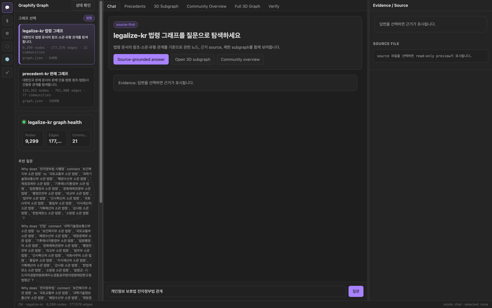
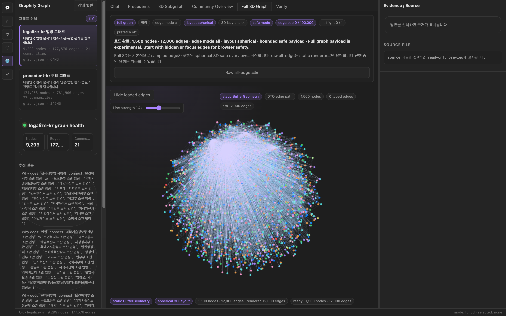
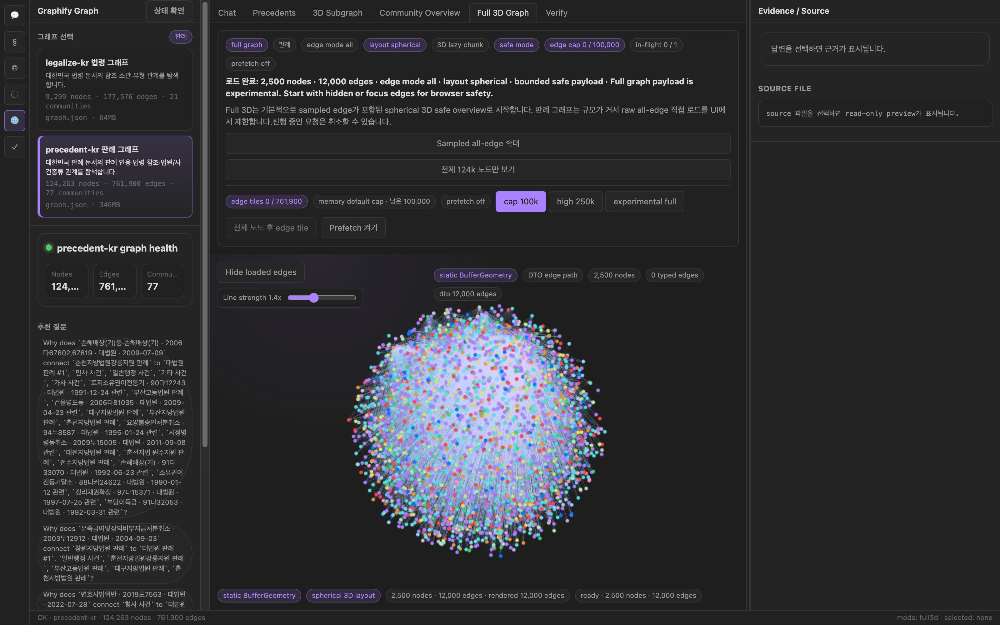

<div align="center">
           
<br>


# ⚖️ Graphify Legal Wiki

[](#-시작하기)
[](#-legal-graph-chat-실행)
[](#-legal-graph-chat-실행)
[](#)
[](#-아키텍처)
[](./LICENSE)
[](#-법령-그래프-생성)

**대한민국 법령(法令) · 판례(判例) 지식 그래프 시스템**

5,665개 법령 · 123,558개 판례를 지식 그래프로 변환하고  
FastAPI + React 기반 인터랙티브 채팅 인터페이스로 탐색합니다.

[법령 그래프](#-법령-그래프-생성) · [판례 그래프](#-판례-그래프-생성) · [Chat 앱](#-legal-graph-chat-실행) · [API](#-api-레퍼런스)

</div>

---

## 📸 스크린샷

<div align="center">

<br/>
<sub><b>메인 채팅 화면</b> · 좌측 그래프 셀렉터(법령/판례) + 헬스 카드 + 추천 질문, 중앙 source-grounded answer 패널, 우측 evidence/source 뷰어</sub>

<br/><br/>

<table>
<tr>
<td align="center" width="50%">
<br/>
<sub><b>법령 3D 그래프</b><br/>9,299 nodes · 177,576 edges · 21 communities<br/>spherical 3D layout · sampled 1,500 노드 / 12,000 edges</sub>
</td>
<td align="center" width="50%">
<br/>
<sub><b>판례 3D 그래프</b><br/>124,263 nodes · 761,900 edges · 77 communities<br/>spherical 3D layout · sampled 2,500 노드 / 12,000 edges</sub>
</td>
</tr>
</table>

</div>

---

## 개요

```text
┌─────────────────────────────────────────────────────────────────┐
│                     Korean Legal Knowledge Graph                │
├──────────────────────┬──────────────────────────────────────────┤
│   data/legalize-kr/  │          data/precedent-kr/              │
│   법령 5,665 파일    │          판례 123,558 파일               │
│   (YAML frontmatter) │          (YAML frontmatter)              │
└──────────┬───────────┴──────────────────┬───────────────────────┘
           │  deterministic extraction    │
           ▼  (No LLM · $0)              ▼
┌──────────────────────┬──────────────────────────────────────────┐
│  graphify-out/       │  graphify-out/                           │
│  9,299 nodes         │  124,263 nodes                           │
│  177,576 edges       │  761,900 edges                           │
│  12 communities      │  72 communities                          │
└──────────┬───────────┴──────────────────┬───────────────────────┘
           │                              │
           ▼                              ▼
┌─────────────────────────────────────────────────────────────────┐
│              apps/legal-graph-chat                              │
│  FastAPI Backend (port 8765) + React/Vite Frontend (port 5173) │
│  법령 검색 · 판례 검색 · 3D 그래프 · 커뮤니티 탐색             │
└─────────────────────────────────────────────────────────────────┘
```

---

## 📦 주요 기능

| 기능 | 설명 |
|------|------|
| 🔍 **법령 지식 그래프** | 법률·시행령·시행규칙 계층구조 + `「법령명」` 참조 자동 추출 |
| 📋 **판례 지식 그래프** | 선고법원·사건종류 분류 + 판례 간 인용 엣지 자동 추출 |
| ⚡ **Zero LLM Cost** | YAML frontmatter 결정성 파싱 — Claude/GPT API 호출 없음 |
| 🌐 **인터랙티브 그래프** | vis.js 기반 HTML 그래프 — 클릭·검색·커뮤니티 필터링 |
| 💬 **Legal Graph Chat** | 법령/판례 원문 + 그래프 기반 Q&A (FastAPI + React) |
| 🔗 **교차 참조** | 판례→법령 인용 허브 노드 (483개 법령, ≥100회 인용) |
| 📖 **Wiki 자동 생성** | 커뮤니티별 Wikipedia 스타일 아티클 (법령 25개 · 판례 83개) |
| 🗂️ **MCP 서버** | `graph.json` MCP 서버로 AI 어시스턴트 직접 연결 |

---

## 📊 데이터 현황

### ⚖️ 법령 (Legalize-KR)

| 항목 | 수치 |
|------|------|
| 입력 파일 | 5,665개 법령 `.md` |
| 총 단어 수 | 23,519,468 |
| 노드 | 9,299 |
| 엣지 | 177,576 |
| 커뮤니티 | 12개 (소관부처 기준) |
| 참조 매칭 | 375,633개 `「법령명」` |
| Wiki 아티클 | 25개 |
| LLM 비용 | $0 |

### 📋 판례 (Precedent-KR)

| 항목 | 수치 |
|------|------|
| 입력 파일 | 123,558개 판례 `.md` |
| 사건 종류 | 민사 · 형사 · 세무 · 일반행정 · 가사 · 특허 · 선거 |
| 노드 | 124,263 |
| 엣지 | 761,900 |
| 커뮤니티 | 72개 (사건종류 기준) |
| 판례→판례 인용 | 244,504개 (`선고 사건번호 판결` 패턴) |
| 법령 참조 허브 | 483개 (≥100회 인용 법령) |
| Wiki 아티클 | 83개 |
| LLM 비용 | $0 |

---

## 🏗️ 아키텍처

```text
dev-plan/scripts/
├── graphify_legalize_deterministic.py    # 법령 그래프 빌더
└── graphify_precedent_deterministic.py   # 판례 그래프 빌더

data/
├── legalize-kr/
│   ├── kr/{법령명}/{법률·시행령·시행규칙}.md   # YAML frontmatter + 본문
│   └── graphify-out/                           # 생성된 그래프 결과물
│       ├── graph.json    (86 MB)
│       ├── graph.html
│       ├── GRAPH_REPORT.md
│       └── wiki/
└── precedent-kr/
    ├── {사건종류}/{법원등급}/{사건번호}.md       # YAML frontmatter + 본문
    └── graphify-out/                           # 생성된 그래프 결과물
        ├── graph.json    (428 MB)
        ├── graph.html
        ├── GRAPH_REPORT.md
        └── wiki/

apps/legal-graph-chat/
├── backend/      # FastAPI (Python 3.11)
├── frontend/     # React + Vite + TypeScript
└── deploy/       # Docker + nginx
```

### 노드 종류

| node_kind | 설명 | 데이터셋 |
|-----------|------|---------|
| `law_document` | 법령 문서 (법률·시행령·시행규칙) | 법령 |
| `family` | 법령 패밀리 그룹 (예: 민법) | 법령 |
| `ministry` | 소관부처 (예: 법무부) | 법령 |
| `legal_type` | 법령구분 (법률·대통령령·부령) | 법령 |
| `article_topic` | 공통 조문 주제 허브 | 법령 |
| `external_law_reference` | 미매칭 외부 법령 참조 | 법령 |
| `precedent_case` | 판례 문서 | 판례 |
| `case_type` | 사건종류 (민사·형사·세무 등) | 판례 |
| `court_tier` | 법원등급 (대법원·하급심) | 판례 |
| `court` | 법원명 (서울중앙지방법원 등) | 판례 |
| `external_law_ref` | 고빈도 법령 참조 허브 | 판례 |

### 엣지 종류

| relation | 방향 | 설명 |
|----------|------|------|
| `references` | 법령 → 법령 | `「법령명」` 명시적 인용 |
| `implements` | 시행령 → 법률 | 같은 패밀리 계층 구조 |
| `belongs_to_family` | 법령 → family | 법령 그룹 소속 |
| `administered_by` | 법령 → ministry | 소관부처 연결 |
| `cites_precedent` | 판례 → 판례 | `선고 사건번호 판결` 인용 |
| `cites_law` | 판례 → 법령허브 | `법령명 제N조` 인용 |
| `is_case_type` | 판례 → case_type | 사건종류 분류 |
| `decided_by_court` | 판례 → court | 선고법원 연결 |

---

## 📋 사전 요구사항

```bash
# Python 3.11 (프로젝트 전용 venv)
python3.11 --version

# uv (패키지 관리 — 권장)
curl -LsSf https://astral.sh/uv/install.sh | sh

# Node.js 18+ (프론트엔드)
node --version
```

---

## 🚀 시작하기

```bash
# 저장소 클론
git clone https://github.com/coreline-ai/graphify-legal-wiki.git
cd graphify-legal-wiki

# Python 의존성 설치 (전체 — 그래프 빌더 포함)
uv sync --all-extras

# 설치 확인
.venv/bin/python -c "import graphify; print('OK')"
```

---

## ⚡ 법령 그래프 생성

`data/legalize-kr/` 폴더에 법령 데이터가 있어야 합니다.

```bash
# 법령 지식 그래프 빌드 (LLM 없음 · $0 · 약 5~10분 소요)
.venv/bin/python dev-plan/scripts/graphify_legalize_deterministic.py
```

### 출력 파일

```text
data/legalize-kr/graphify-out/
├── graph.json          # 전체 그래프 (NetworkX JSON, 86 MB)
├── graph.html          # 인터랙티브 그래프 (브라우저에서 바로 열기)
├── GRAPH_REPORT.md     # God nodes · 놀라운 연결 · 추천 질문
├── run-summary.json    # 실행 통계
├── cost.json           # 토큰 비용 (항상 $0)
└── wiki/               # 소관부처별 Wikipedia 스타일 아티클 (25개)
    ├── index.md
    ├── 행정안전부_소관_법령.md
    ├── 법무부_소관_법령.md
    └── ...
```

### 결과 확인

```bash
# 실행 결과 요약
cat data/legalize-kr/graphify-out/run-summary.json

# 인터랙티브 그래프 열기 (브라우저)
open data/legalize-kr/graphify-out/graph.html

# 주요 분석 리포트
cat data/legalize-kr/graphify-out/GRAPH_REPORT.md
```

### 데이터 구조 (법령)

```yaml
# 예: data/legalize-kr/kr/민법/법률.md
---
제목: 민법
법령MST: 284415
법령ID: "001001"
법령구분: 법률
소관부처:
  - 법무부
공포일자: 2024-01-02
시행일자: 2024-07-03
상태: 시행
출처: https://www.law.go.kr/법령/민법
---

# 제1편 총칙
## 제1장 통칙
### 제1조(법원) 민사에 관하여 법률에 규정이 없으면 …
```

---

## ⚡ 판례 그래프 생성

`data/precedent-kr/` 폴더에 판례 데이터가 있어야 합니다.

```bash
# 판례 지식 그래프 빌드 (LLM 없음 · $0 · 약 30~60분 소요)
.venv/bin/python dev-plan/scripts/graphify_precedent_deterministic.py
```

### 출력 파일

```text
data/precedent-kr/graphify-out/
├── graph.json          # 전체 그래프 (NetworkX JSON, 428 MB)
├── graph.html          # 인터랙티브 그래프 (aggregated 모드)
├── GRAPH_REPORT.md     # God nodes · 판례 네트워크 분석
├── run-summary.json    # 실행 통계
└── wiki/               # 사건종류별 Wikipedia 스타일 아티클 (83개)
    ├── index.md
    ├── 민사_사건.md
    ├── 형사_사건.md
    ├── 세무_사건.md
    └── ...
```

### 데이터 구조 (판례)

```yaml
# 예: data/precedent-kr/민사/하급심/2020가합3296.md
---
판례일련번호: '600423'
사건번호: 2020가합3296
사건명: 손해배상청구
법원명: 서울중앙지방법원
법원등급: 하급심
사건종류: 민사
선고일자: 2021-04-08
출처: https://www.law.go.kr/LSW/precInfoP.do?precSeq=600423
---

# 손해배상청구

## 판례내용
…
## 참조조문
민법 제580조, 자본시장과 금융투자업에 관한 법률 제8조 …
```

### 참조 추출 패턴

| 추출 대상 | 패턴 | 예시 |
|----------|------|------|
| 판례→판례 | `선고 {사건번호} 판결` | `선고 2012다65317 판결` |
| 판례→법령 | `{법령명} 제N조` | `민법 제580조` |

---

## 🖥️ Legal Graph Chat 실행

법령/판례 그래프를 채팅 인터페이스로 탐색합니다.

### 1. 환경 설정

```bash
cd apps/legal-graph-chat

# 환경변수 파일 생성
cp .env.example .env
```

`.env` 파일에서 LLM 프로바이더 설정:

```bash
# 법령 그래프 경로 (기본값: data/legalize-kr)
LEGAL_GRAPH_SOURCE_ROOT=../../data/legalize-kr

# 판례 코퍼스 경로 (기본값: data/precedent-kr)
LEGAL_GRAPH_PRECEDENT_ROOT=../../data/precedent-kr

# LLM 답변 생성 (선택)
CORELINE_CODEX_API_KEY=your_key_here
```

### 2. 백엔드 실행

```bash
cd apps/legal-graph-chat/backend

# 의존성 설치
pip install -r requirements.txt

# 서버 실행 (port 8765)
uvicorn app.main:app --host 127.0.0.1 --port 8765
```

### 3. 프론트엔드 실행

```bash
cd apps/legal-graph-chat/frontend

# 의존성 설치
npm install

# 개발 서버 실행 (port 5173)
npm run dev
```

브라우저에서 `http://localhost:5173` 접속

### 4. Docker로 한 번에 실행

```bash
cd apps/legal-graph-chat
docker compose -f deploy/compose.prod.yml up -d
```

---

## ⚙️ 환경 변수

| 변수 | 기본값 | 설명 |
|------|--------|------|
| `LEGAL_GRAPH_SOURCE_ROOT` | `data/legalize-kr` | 법령 그래프 소스 경로 |
| `LEGAL_GRAPH_PRECEDENT_ROOT` | `data/precedent-kr` | 판례 코퍼스 경로 |
| `LEGAL_GRAPH_SOURCE_VIEWER_ENABLED` | `true` | 법령 원문 뷰어 활성화 |
| `LEGAL_GRAPH_PRECEDENT_SOURCE_VIEWER_ENABLED` | `true` | 판례 원문 뷰어 활성화 |
| `LEGAL_GRAPH_SOURCE_MAX_CHARS` | `40000` | 원문 조회 최대 글자 수 |
| `LEGAL_GRAPH_AUTH_REQUIRED` | `false` | 프록시 인증 필요 여부 |
| `LEGAL_GRAPH_METRICS_ENABLED` | `true` | Prometheus `/metrics` 엔드포인트 활성화 |
| `LEGAL_GRAPH_METRICS_PUBLIC` | `false` | `/metrics`를 인증 우회 공개 경로로 둘지 여부. 기본값은 인증 정책을 따름 |
| `CORELINE_CODEX_API_KEY` | — | LLM 답변 생성용 API 키 |

---

## 📖 API 레퍼런스

백엔드 기본 URL: `http://127.0.0.1:8765`

### 법령 그래프

| 메서드 | 경로 | 설명 |
|--------|------|------|
| `GET` | `/health` | 그래프 로드 상태 확인 |
| `POST` | `/query` | 키워드 기반 서브그래프 탐색 |
| `POST` | `/answer` | LLM 기반 법령 Q&A |
| `GET` | `/explain?label=민법` | 특정 노드 상세 설명 |
| `GET` | `/subgraph?node_id=...` | 노드 중심 서브그래프 |
| `GET` | `/communities/3d` | 커뮤니티 3D 데이터 |
| `GET` | `/graph/full-3d` | 전체 그래프 3D |
| `GET` | `/source?path=...` | 법령 원문 조회 |
| `GET` | `/suggested-questions` | 추천 질문 목록 |

### 판례

| 메서드 | 경로 | 설명 |
|--------|------|------|
| `GET` | `/precedents/health` | 판례 코퍼스 상태 |
| `GET` | `/precedents/search?q=손해배상` | 판례 키워드 검색 |
| `GET` | `/precedents/search?q=...&category=민사` | 사건종류 필터 검색 |
| `GET` | `/precedents/source?path=...` | 판례 원문 조회 |

### 쿼리 예시

```bash
# 법령 검색
curl -X POST http://127.0.0.1:8765/query \
  -H "Content-Type: application/json" \
  -d '{"question": "개인정보 보호법 전자정부법 관계", "max_nodes": 50}'

# 판례 검색
curl "http://127.0.0.1:8765/precedents/search?q=손해배상&category=민사&limit=10"

# 법령 노드 설명
curl "http://127.0.0.1:8765/explain?label=민법"
```

---

## 📁 프로젝트 구조

```text
graphify-legal-wiki/
├── 📂 apps/
│   └── legal-graph-chat/
│       ├── backend/            # FastAPI 백엔드
│       │   ├── app/
│       │   │   ├── main.py         # API 엔드포인트
│       │   │   ├── service.py      # 그래프 쿼리 서비스
│       │   │   ├── models.py       # Pydantic 모델
│       │   │   └── precedent_index.py  # 판례 인덱스
│       │   └── requirements.txt
│       ├── frontend/           # React + Vite + TypeScript
│       │   └── src/
│       │       ├── App.tsx         # 메인 컴포넌트
│       │       ├── api/            # API 클라이언트
│       │       └── components/     # UI 컴포넌트
│       └── deploy/             # Docker + nginx 배포
├── 📂 data/
│   ├── legalize-kr/            # 법령 데이터 + 그래프 결과
│   └── precedent-kr/           # 판례 데이터 + 그래프 결과
├── 📂 dev-plan/
│   └── scripts/
│       ├── graphify_legalize_deterministic.py   # 법령 그래프 빌더
│       └── graphify_precedent_deterministic.py  # 판례 그래프 빌더
├── 📂 graphify/                # 핵심 그래프 엔진
│   ├── build.py                # NetworkX 그래프 빌드
│   ├── cluster.py              # Leiden 커뮤니티 탐지
│   ├── analyze.py              # God nodes · 연결 분석
│   ├── export.py               # HTML · JSON · SVG 출력
│   └── wiki.py                 # Wiki 아티클 생성
├── README.md
├── README.old.md               # 원본 graphify README
└── pyproject.toml
```

---

## 🔧 트러블슈팅

**그래프 생성이 느린 경우**

판례 그래프(123K 파일)는 약 30~60분이 소요됩니다.  
진행 상황은 터미널 출력으로 확인할 수 있습니다:

```
Loading documents …
Building precedent case nodes …
Matching case-to-case citation edges …
Building external law reference hubs …
  483 law hubs created (≥100 mentions).
Extraction done: 124,263 nodes · 761,900 edges
```

**`ModuleNotFoundError: No module named 'yaml'`**

```bash
uv sync --all-extras
```

**백엔드 포트 충돌**

```bash
# 사용 중인 포트 확인
lsof -i :8765
# 다른 포트로 실행
uvicorn app.main:app --host 127.0.0.1 --port 8766
```

**graph.json 없음 오류**

먼저 그래프를 생성해야 합니다:

```bash
.venv/bin/python dev-plan/scripts/graphify_legalize_deterministic.py
# 또는
.venv/bin/python dev-plan/scripts/graphify_precedent_deterministic.py
```

---

## 🤝 기여

```bash
# 1. 저장소 포크 후 클론
git clone https://github.com/coreline-ai/graphify-legal-wiki.git

# 2. 브랜치 생성
git checkout -b feature/your-feature

# 3. 변경 후 테스트
.venv/bin/python -m pytest tests/

# 4. PR 제출
```

---

## 📜 라이선스

[MIT License](./LICENSE) © 2026 Coreline AI

---

<div align="center">

**⚖️ 이 시스템의 답변은 그래프 탐색 결과이며 법률 자문이 아닙니다.**  
**반드시 원문과 전문가 검토로 확인하세요.**

</div>
